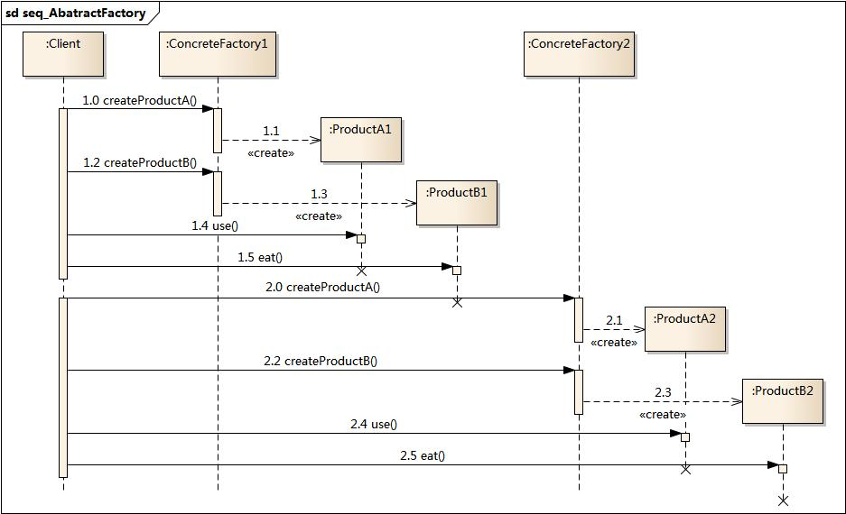

## 简介 ##

## 简单工厂模式 ##

### 说明 ###

**简单工厂**概念：
简单工厂并不是一个设计模式，反而更像是一种编程习惯。

### 图例 ###

## 工厂方法模式 ##

### 图例 ###

## 抽象工厂模式 ##

### 图例 ###

## 三者的小结与区别 ##

三者都属于设计模式中的创建型模式，其主要作用是帮助使用者把对象的实例化部分抽取出来，从而优化系统架构，并增强系统的扩展性。

简单工厂模式的工厂类一般是使用静态方法，通过接收的参数不同来返回不同的对象实例。不修改代码，就无法实现扩展。
工厂方法模式是针对每一种产品提供一个工厂类，通过不同的工厂实例来创建不同的产品实例。在同一等级结构中，支持增加任意产品。
抽象工厂模式通常包含着工厂方法模式，使每个方法实际上看起来都像是工厂方法。

## 设计原则 ##

- 变量不可以持有具体类的引用
- 不要让类派生自具体类