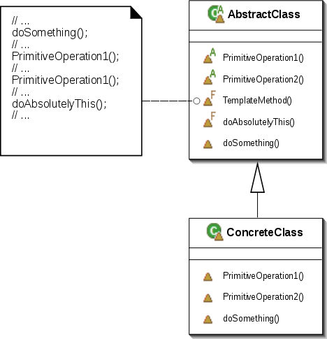

## 简介 ##

**模版方法**概念：
模板方法模式定义了一个算法的步骤，并允许子类别为一个或多个步骤提供其实践方式。让子类别在不改变算法架构的情况下，重新定义算法中的某些步骤。

## 图例 ##

### UML ###

## 示例 ##

抽象类 Game 代表游戏总类，其中 initial() 方法表示底层初始化，是每个游戏都相同拥有的固定形式，所以由抽象类实现。而 startPlay() 和 endPlay() 每个游戏不同，所以由子类实现，抽象类只需定义好即可。

## 说明 ##

模版方法多用在：

- 某些类别的算法中，实做了相同的方法，造成程式码的重复
- 控制子类别必须遵守的一些事项